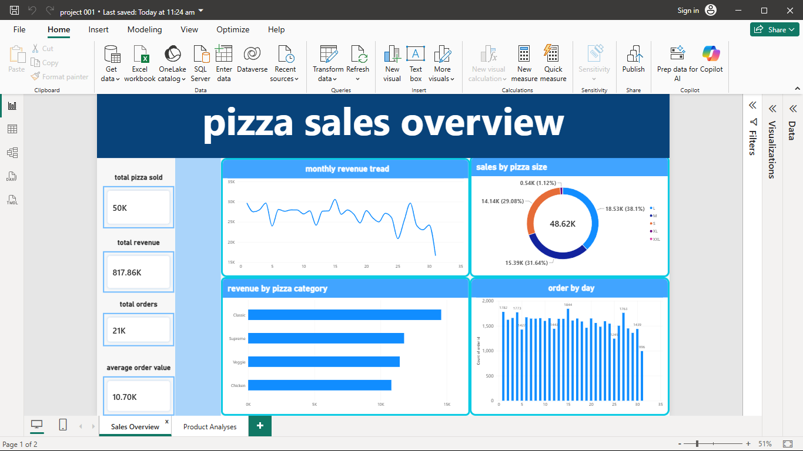

# 🍕 Pizza Sales Analysis — Power BI

## 📊 Project #1 — Data Analyst Portfolio

This project is a **Pizza Sales Analysis Dashboard** created using **Power BI**.

It analyzes sales performance, revenue, orders, pizza quantity, product performance, pizza categories, pizza sizes, and sales trends.

---

## 🛠️ Tools Used

- **Power BI**
- **DAX**
- **Power Query**
- **Excel / CSV**
- **Data Visualization**

---

## 📌 Key KPIs

- 💰 Total Revenue
- 🧾 Total Orders
- 🍕 Total Pizza Sold
- 📊 Average Order Value
- 💵 Average Unit Price

---

## 📈 Dashboard Pages

### 1. Sales Overview

Provides a high-level view of pizza sales performance.

**Visuals:**
- Monthly Revenue Trend
- Sales by Pizza Size
- Revenue by Pizza Category
- Orders by Day
- KPI Cards

### 2. Product Analysis

Provides detailed product-level analysis.

**Visuals:**
- Top 10 Pizzas by Revenue
- Top 10 Best-Selling Pizzas
- Unit Price vs Quantity
- Category vs Size
- Pizza Size & Category Filters
- Date Filters

---

## 📸 Dashboard Screenshots

### Sales Overview



### Product Analysis


---

## 🧮 Key DAX Measures

```DAX
Total Revenue =
SUM(pizza_sales[total price])
```

```DAX
Total Orders =
DISTINCTCOUNT(pizza_sales[order id])
```

```DAX
Total Pizza Sold =
SUM(pizza_sales[quantity])
```

```DAX
Average Order Value =
DIVIDE(
    [Total Revenue],
    [Total Orders]
)
```

---

## 🔍 Business Questions Answered

- What is the total revenue generated?
- How many orders were placed?
- How many pizzas were sold?
- What is the average order value?
- Which pizza sizes generate the most sales?
- Which pizza categories generate the most revenue?
- What are the top 10 pizzas by revenue?
- What are the top 10 best-selling pizzas?
- How do sales change by day and month?
- What is the relationship between unit price and quantity?

---

## 📂 Project Structure

```text
Data-Analyst-Portfolio/
│
├── README.md
│
├── Pizza-Sales-Analysis/
│   │
│   ├── Pizza_Sales_Dashboard.pbix
│   ├── pizza_sales.csv
│   ├── README.md
│   │
│   └── screenshots/
│       ├── overview.png
│       └── Product_analysis.png
```

---

## 🎯 Skills Demonstrated

- Data Cleaning
- Data Transformation
- Data Modeling
- DAX
- KPI Creation
- Data Visualization
- Dashboard Design
- Business Analysis
- Power BI Reporting

---

## 👤 Author

**Prasanth**

Aspiring Data Analyst  
**Excel | SQL | Power BI | DAX**

⭐ Thanks for visiting my project!
